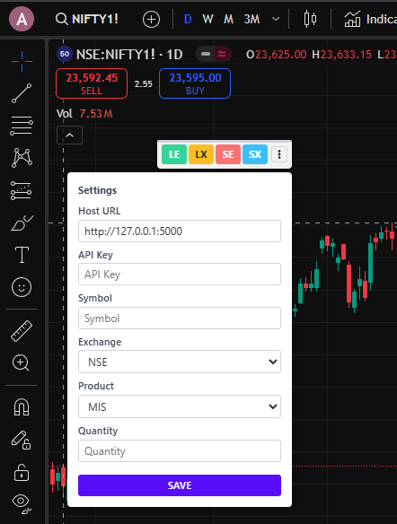

# OpenAlgo Chrome Extension

A lightweight Chrome extension for OpenAlgo trading platform with DaisyUI-inspired UI controls.

## Features

- **Quick Trading Actions**: One-click access to LE (Long Entry), LX (Long Exit), SE (Short Entry), and SX (Short Exit) trading operations
- **Compact Interface**: Minimal, draggable interface that stays out of your way while trading
- **Integrated Settings**: Easy access to configuration via the vertical dots menu
- **Modern UI**: DaisyUI-inspired styling with clean, modern aesthetics
- **Notification System**: Clear visual feedback for all trading actions

## Prerequisites

- **OpenAlgo API Server**: The OpenAlgo server must be running and accessible before using this extension
- **API Key**: You must have a valid API key for the OpenAlgo platform
- **Configuration**: You must configure all settings before placing any orders

## Installation

### From Chrome Web Store
*Coming soon*

### Manual Installation
1. Download or clone this repository
2. Open Chrome and navigate to `chrome://extensions/`
3. Enable "Developer mode" at the top right
4. Click "Load unpacked" and select the directory containing the extension files
5. The OpenAlgo extension icon should appear in your browser toolbar

## Usage

### Getting Started
1. **Start OpenAlgo Server**: Ensure your OpenAlgo API server is running and accessible
2. **Configure Settings**: Click the vertical dots (⋮) menu and fill in all required settings
3. **Save Settings**: Click the Save button to store your configuration
4. **Place Orders**: Only after completing the above steps, use the trading buttons

### Trading Controls
The extension injects a compact row of trading buttons into any webpage:

- **LE** (Green): Long Entry - Place a buy order to open a long position
- **LX** (Yellow): Long Exit - Close an existing long position
- **SE** (Red): Short Entry - Place a sell order to open a short position  
- **SX** (Blue): Short Exit - Close an existing short position

### Configuration
Click the vertical dots (⋮) menu to access settings:

1. **Host URL**: Your OpenAlgo API server address (default: http://127.0.0.1:5000)
2. **API Key**: Your unique OpenAlgo API key
3. **Symbol**: Trading symbol/instrument (e.g., BHEL)
4. **Exchange**: Select from NSE, BSE, BFO, NFO, MCX, or CDS
5. **Product**: Select from MIS, NRML, or CNC
6. **Quantity**: Number of units to trade

### Dragging
- The entire button bar can be dragged to reposition it anywhere on the screen
- A thin grab handle appears at the top when hovering

## Troubleshooting

- **No Response from Buttons**: Ensure your OpenAlgo server is running and accessible
- **Error Messages**: Check that all settings are correctly configured
- **Connection Issues**: Verify the Host URL is correct and your server is reachable

## Development

### Project Structure
- `manifest.json`: Extension configuration
- `popup.html/js`: Extension popup interface
- `contentScript.js`: Injects trading controls into web pages
- `css/styles.css`: DaisyUI-inspired custom styling

### Recent Enhancements
- Modern UI with DaisyUI-inspired components
- Compact and draggable button interface
- Improved settings panel with better form controls
- Added loading indicators for API operations
- Visual notification system for trade actions

## Requirements

- Chrome browser version 88 or higher
- OpenAlgo API server (running locally or remotely)
- Valid API key for OpenAlgo platform

## License

This project is licensed under the MIT License - see the [LICENSE](LICENSE) file for details.

Copyright (c) 2025 Marketcalls
